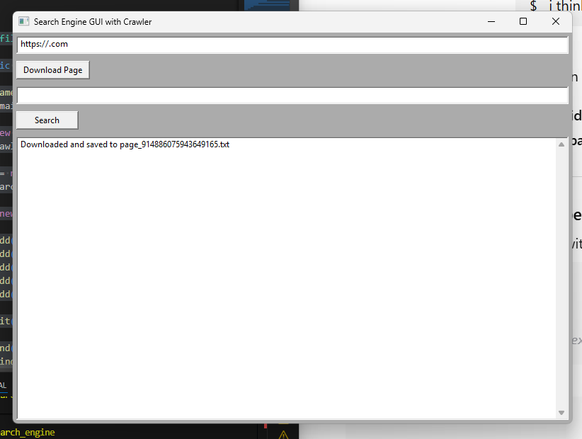

# 🕸️ wxWidgets Search Engine with Web Crawler

<p align="center">
    <a href="https://github.com/your-username/your-repo"></a>
    <a href="https://github.com/your-username/your-repo/actions"></a>
    <a href="https://img.shields.io/badge/license-MIT-blue"></a>
    
</p>

Lightweight desktop search engine built in C++ using wxWidgets for GUI and libcurl for fetching pages. Stores fetched pages as plain-text files and provides fast offline full-text search with context snippets — ideal as a recruiter-facing demo or a small offline search utility.

---

## 🚀 Features

- Fetch HTTP(S) pages using libcurl and save as plain-text `.txt` files (SHA-256 hashed filenames).
- Offline full-text search across saved files with filename, line number, and snippet preview.
- Search options: case-sensitive toggle and whole-word matching.
- Simple 3-pane GUI (downloads, fetcher, search/results + preview) built with wxWidgets.
- No external DB — data stored under app data/downloads.
- Context actions: Open file, Copy snippet, Reveal in Explorer.
- Extensible: designed for adding multithreaded crawling, inverted index, or SQLite metadata.

---

## 🛠️ Installation

Prerequisites
- C++17 toolchain (g++, clang, or MSVC)
- wxWidgets (development headers)
- libcurl (development headers)
- CMake (optional but recommended)

Linux (Ubuntu/Debian example)
```bash
sudo apt update
sudo apt install build-essential cmake libwxgtk3.0-gtk3-dev libcurl4-openssl-dev
```

macOS (Homebrew)
```bash
brew install wxwidgets curl cmake
```

Windows (MSYS2 / MinGW recommended)
- Install MSYS2, then:
```bash
pacman -S mingw-w64-x86_64-toolchain mingw-w64-x86_64-wxWidgets mingw-w64-x86_64-curl
```

Build (CMake recommended)
```bash
git clone https://github.com/your-username/your-repo.git
cd your-repo
mkdir build && cd build
cmake ..
cmake --build . --config Release
# Resulting binary: search_engine (or search_engine.exe)
```

Quick single-file build (example)
```bash
# Linux/macOS using wx-config
g++ main.cpp `wx-config --cxxflags --libs` -lcurl -std=c++17 -o search_engine
```

Output location
- Saved pages: <app_data>/downloads/page_<sha256>.txt  
Each file contains the original URL, fetch timestamp, and plain-text content.

---

## 💡 Usage

Start the app (GUI)
```bash
./search_engine
```

Typical workflow
1. Enter a URL in the fetcher pane and click Fetch. The app downloads and saves the page.
2. Switch to Search pane, type a keyword or phrase.
3. Toggle case-sensitivity / whole-word options if needed.
4. Click a result to view the file at the matching line. Use context menu to Open, Copy snippet, or Reveal in Explorer.

Command-line (headless fetch helper, if included)
```bash
# Example helper to fetch a URL and save as text (if provided)
./search_engine --fetch "https://example.com"
```

Tips
- Files are incremental and immutable: duplicates detected via SHA-256.
- Use the downloads pane to remove or re-fetch pages.

---

## 📸 Screenshots / Demo

Include these assets in the `assets/` folder of the repo (or place repository screenshots under `docs/` as shown):

- docs/screenshot_gui.png — full GUI screenshot (committed to docs/)
- assets/ui_fetcher.png — fetcher panel
- assets/ui_search.png — search & results
- assets/demo.gif — short GIF showing fetch → search → preview

Example markdown to show images:
<p align="center">
    
    <br/>
    
    <br/>
    
    <br/>
    
</p>

---

## 👨‍💻 Contributing

Guidelines
- Fork the repo, create a feature branch: git checkout -b feat/short-desc
- Keep PRs focused and include a concise description of changes.
- Add tests for new logic where applicable (see Tests section).
- Follow existing code style and comment non-obvious logic.
- For UI changes, include updated screenshots or GIFs.

Suggested improvements
- Add inverted index for fast queries
- Parallel fetcher with polite rate-limiting
- Highlight matched snippets in preview
- Optional SQLite store for metadata and query stats

---

## 🧪 Tests

If tests are included, run them from the build directory:
```bash
# Example for CTest
ctest --output-on-failure
```

Recommended test areas
- HTML → plain-text normalization
- SHA-256 filename generation (duplicate detection)
- Line-by-line search behavior: case/whole-word correctness
- File I/O: read/write integrity across platforms

Consider adding a small unit-test harness using Catch2 or GoogleTest for parser and search logic.

---

## 📄 License

MIT License — see LICENSE file for full text.

---

If you want, I can produce a ready-to-copy CMakeLists.txt, a sample demo GIF script, or a concise CONTRIBUTING.md next.
